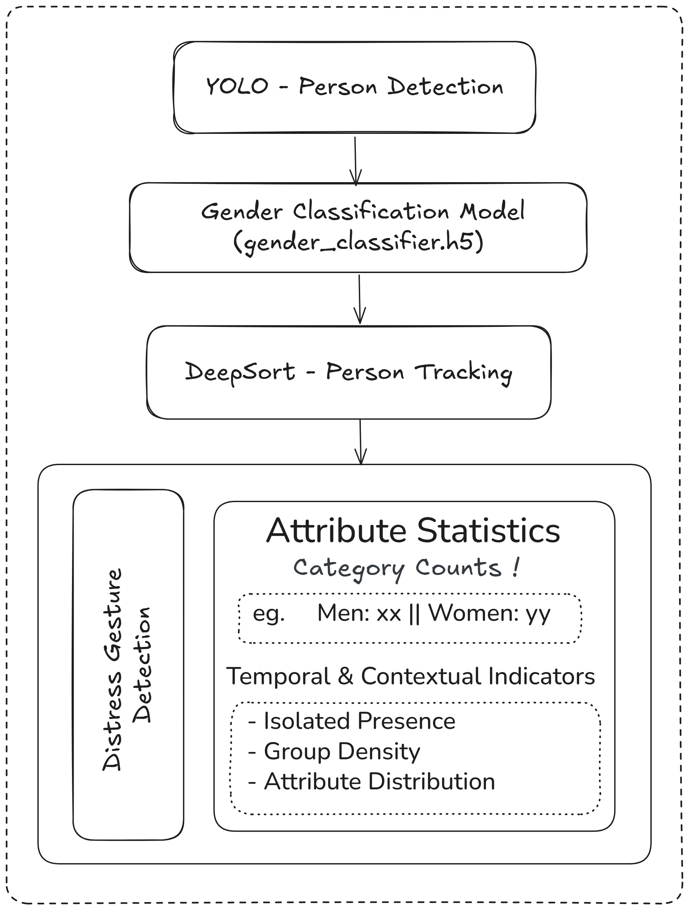
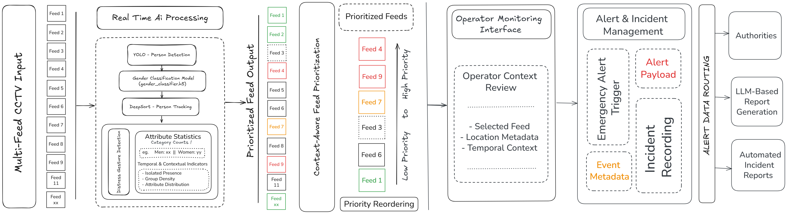

# Illumination-Invariant-Human-Attribute-Recognition-with-Pose-Guided-Group-Interaction-Model

  
  
  
  
  
  
  
  

**Context-Aware Public-Space Safety Monitoring** is a real-time intelligent surveillance framework designed to transform traditional CCTV systems into assistive decision-support systems.

Unlike conventional systems that only record video, this framework integrates **person detection, multi-object tracking, attribute recognition, and contextual reasoning** to generate **interpretable safety cues** for human operators.

Developed as an academic research project, the system focuses on **assistive surveillance**, ensuring ethical deployment by avoiding:

- Identity recognition
- Crime prediction
- Autonomous enforcement

---

## Problem Motivation

Traditional CCTV systems:

- Require continuous human monitoring
- Lead to **operator fatigue** and missed events
- Provide **raw data without interpretation**

This project addresses the gap between:

> **Detection → Understanding → Actionable Insight**

---

## Key Contributions

- **Context-Aware Surveillance Pipeline**
- **Group Composition & Scene Understanding**
- **Real-Time Feed Prioritization**
- **Illumination-Robust Processing**
- **Privacy-Preserving Design (No Identification)**

---

## Overview

This project is a real-time intelligent surveillance system that enhances traditional CCTV by converting raw video feeds into meaningful safety insights.

Instead of only detecting people, the system analyzes scene context and group patterns to highlight important situations and assist human monitoring.

---

## System Architecture

  

The architecture integrates detection, tracking, attribute extraction, and contextual reasoning into a unified pipeline for real-time monitoring.

---

## Processing Pipeline

  

### Workflow

1. Person Detection
2. Multi-Object Tracking
3. Attribute Extraction
4. Context Aggregation
5. Risk Scoring
6. Feed Prioritization
7. Operator Dashboard

---

## Key Features

- Real-time multi-camera processing
- Context-aware scene understanding
- Intelligent feed prioritization
- Works under varying illumination conditions
- Assistive system with human-in-the-loop design

---

## Performance

| Metric              | Value   |
| ------------------- | ------- |
| Detection Accuracy  | 92.4%   |
| Tracking Stability  | 88.7%   |
| Processing Speed    | ~24 FPS |
| Low-Light Retention | 85%     |

---

## Applications

- Smart city surveillance
- Campus security systems
- Public transport monitoring
- Control room analytics

---

## Ethical Design

This system is designed to be responsible and non-intrusive:

- No facial recognition
- No identity tracking
- No crime prediction
- No automated decision-making

The system only assists human operators by highlighting important scenarios.

---

## Limitations

- Requires calibration for different environments
- Performance may degrade in dense crowds and occlusions
- Rule-based logic is not fully adaptive

---

## Future Work

- Adaptive context modeling
- Improved dense crowd tracking
- Edge deployment optimization

---

## Demonstration

  

---

## Contributors

- Sushil Kumar Patra
- Sushant Mahajan
- Parth Atal
- Vansh Rana
- Preeti Khera

---

## License

This project is intended for academic and research purposes only. Unauthorized use is prohibited.

---
